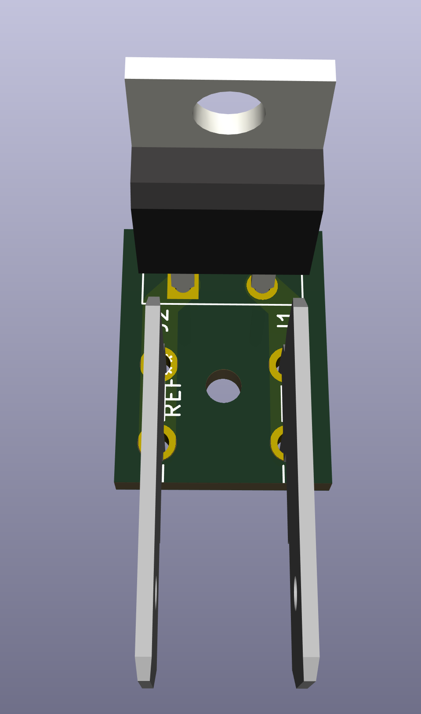
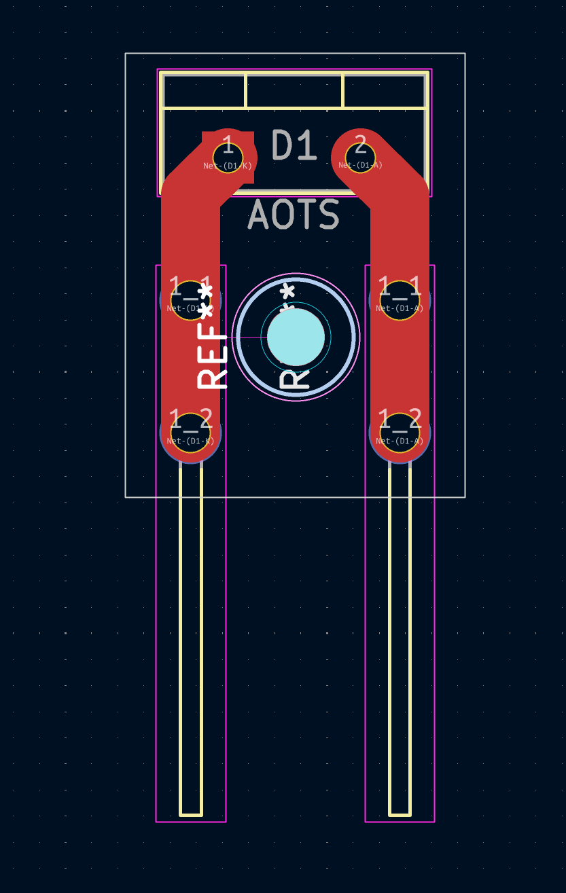

# AOTS_Crimp
Put crimp connectors on the AOTS Sensor using a custom PCB.
The perk here is the ability to have these made via a manufacturing vendor such as:
JLPCB or PCBWay, and have them arive ready to use.
  
<h1> Alternate due to parts availability...</h1>
https://www.digikey.com/en/models/2170998  
 
https://www.sensata.com/products/temperature/6700-series-220-subminiature-thermostat
  

  

